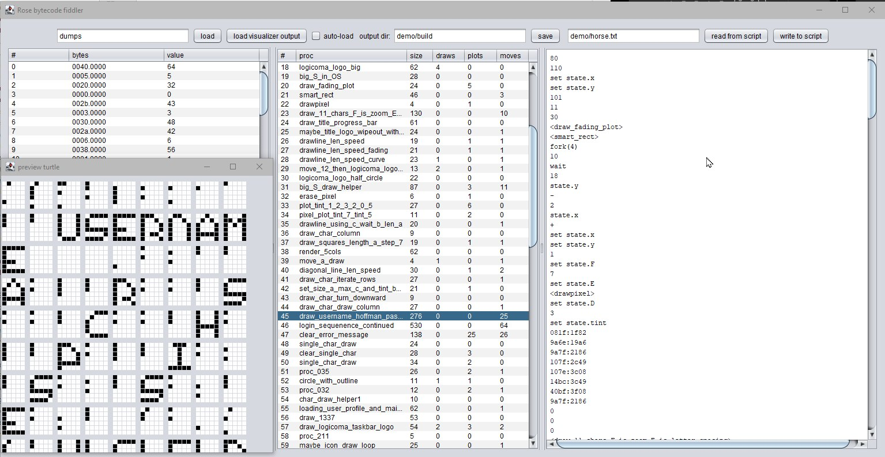
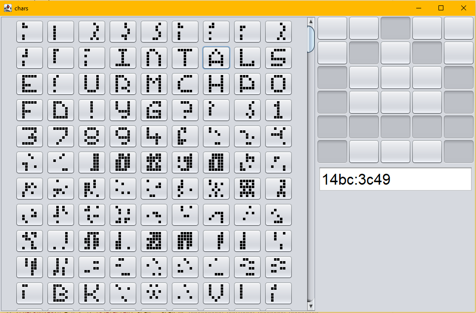

# Putting it all together

The final days: A mixture of adding new code, replacing crashing code and enhancing
the tools.

## Bytecode fiddler

Dumped the idea of editing single procs interactively, using a file-based approach instead.

* Read from the original binary dumps (colors, constants, bytes)
* Write to script files (mostly 1 line = 1 byte, except proc references and high-index constants)
* Read from script files (color script and own disassembly format)

See [RoseBytecodeFiddler.kt](tools/RoseBytecodeFiddler.kt)

## Script authoring

With everything in place and a better understanding of the engine's workings, things
got easier. While not as elegant as a proper decompile-to-Rose solution would have
been, kind of felt like a higher-level language. Especially helpful with that:

* Resolve proc references and assign proc indexes as needed
* Create constant pool as needed by the script (no need to manage them manually)  
* Automatic indentation for conditionals (dramtic readability improvement)
* Assumed stack contents as annotations (accurate for most cases)
* Annotate procedures with their invocations ("call log" with stack/parameter contents)
* Think in reversed polish notation, i.e. stack-based (expression `(1+5)*3` becomes  `1 5 + 3 *` etc.)
* Cheap and helpful: Multiple commands per line (why didn't I think of that early on)
* Cheap and helpful: nicer keywords instead of `BC_FORK(4)`, `BC_DRAW` etc.
* Cheap and helpful: format integer constants in decimal (`15` instead of `000f:0000`)

Code examples:

    state.y :: 16 :: ~ :: + :: set state.y    # go up 16 pixels (~ is negation)
    
    32 :: 5 :: * :: wait                      # wait half a pattern (32 ProTracker rows with speed 5)
    
    <write_poem> :: fork(0)                   # call a proc, taking 0 arguments from the stack
        
    f860:2087
    107e:3c08
    f860:2087
    f041:0107
    f860:2087
    f041:0107
    14bc:3c49
    083f:3082
    f860:2087
    9a6e:19a6
    9a7f:2186
    <draw_11_chars_F_is_zoom_E_is_letter_spacing>
    fork(11)                                       # call a proc with 11 arguments (character bitmaps)
    
    0 :: set state.face
	5 :: 0 :: <drawline_len_speed> :: fork(2)      # look to the right, start a 5-pixel line with speed 0

See [DecompileRose.kt](tools/DecompileRose.kt), [DecompileRecompile.kt](tools/DecompileRecompile.kt), [horse.txt](demo/horse.txt)

## Char editor

Map longword-encoded character bitmaps to their graphical representation, draw own new chars.

See [CharEditor.kt](tools/CharEditor.kt)

This made writing strings a bit less painful, e.g.:

    14bc:3c49 :: 5 :: <single_char_draw> :: fork(2) :: 15 :: wait :: 7 :: move # A
    107f:2c49 :: 5 :: <single_char_draw> :: fork(2) ::  5 :: wait :: 7 :: move # R
    9a6e:19a6 :: 5 :: <single_char_draw> :: fork(2) ::  5 :: wait :: 7 :: move # S
    189c:2186 :: 5 :: <single_char_draw> :: fork(2) ::  5 :: wait :: 7 :: move # C
    823f:3f20 :: 5 :: <single_char_draw> :: fork(2) :: 15 :: wait :: 7 :: move # H

## Other mini tools

* [copyprocs.kt](tools/copyprocs.kt) - add missing procs referenced in horse.txt taken from logicos-script.txt 
* [IconStuff.kt](tools/IconStuff.kt) - convert 16*16 bitmaps to longwords and vice-versa
* [TitleWriter.kt](tools/TitleWriter.kt) - create draw commands from extracted points for the handwriting part 
* [MakeWaveForm.kt](tools/MakeWaveForm.kt)  - create parameters for the waveform shape from [langer.png](sfx/langer.png)
* [typingtimer.kt](tools/typingtimer.kt)  - measure typing speed (unused, no time)
* [RenderColorScript.kt](tools/RenderColorScript.kt)  - visualize the color script in 1 [giant PNG](demo/horse.colorscript.png) (unused)

## Sync

One important thing to put into the runner code ([horse.asm](demo/asm/horse.asm)) was to wait for
the Rose frame counter to become non-zero before starting the music. That would have been a
nightmare to sync otherwise.

## Weird crashes

Would have been nice to figure those out...

* Crashed with some higher-level procs (e.g. the smart rectangle routine with pixel-draw proc as argument)
* Crashed with too many constants (or forks?) per proc; had to simplify the handwriting part quite a bit
* Funnily enough, the intended crash at the end did not work as nicely, while I had plenty of 
  colorful, noisy crashed in all other areas
* Unstable after reboot (content from previous run visible, even when using CLEARMEM=1 or a
  data_c section instead of bss_c; maybe the same root cause as with other strange behaviors?)

## RAM shortage

With the music playback in place, demo would not run with 512k+512k anymore.
Thanks to fabulous support from OpenMPT guru SagaMusix himself (who pointed me to the cleanup feature,
thanks a million!), I could remove enough unused patterns and samples to have it run
again and put in my own crappy samples. Would have been embarassing to require 2 MB chip for this!

