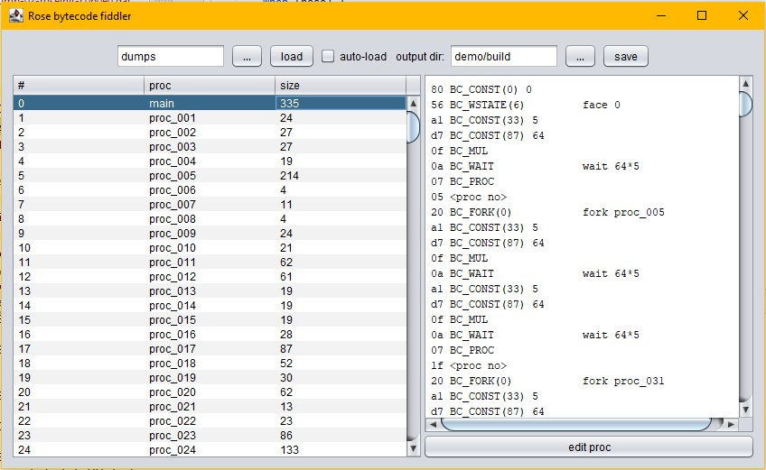

## Decompile Log

Binary to Rose script.

* colorscript.bin = color+reg commands and waits
* constants.bin = 4-byte fixed floating point numbers
* bytecodes.bin = stack-based VM, constant references, immediata-data commands, forks

### Colors

* Wait = -ticks
  * First ticks of wait time is omitted in .rose source
* Color = register + rgb
  * 0xRrgb, R = register

### Constants

* Longwords (4 bytes)
* Fixed-with floating point: value = data / 0x10000

### Bytecode

See: [bytecode.h](Rose/visualizer/bytecode.h)

One-byte commands:

    draw                    byte 04 --> BC_DRAW: call "draw"

Simple stack-based commands:

    move 1                  byte 80 --> push constant no. 0 on the stack (e.g. 0x00010000 == 1.0)
                            byte 0e --> BC_MOVE: pop value from stack and call "move"

etc.

Note: Proc references can be pushed onto the stack, too, and local variables
(not only constant pool references).

Tricky: Calls ("fork" command).

    Rose                        Bytecode
    --------------------------- ------------------------------------------------------------------
    proc main
          ....
         fork wurst 23 42    81    --> const(1)    push 23.0 on stack
                                83    --> const(3)    push 42.0 on stack
                                07 01 --> BC_PROC #1  push proc_001 on stack
                                22    --> BC_FORK(2)  call proc_001 with 2 args from the stack
                                02    --> BC_END      new proc starts
    
    proc wurst a b                 --> need to scan for the highest RC_LOCAL(x) argument until
                                          the next BC_END byte to figure out number of arguments
    
                                60 --> BC_RLOCAL(0) push arg 0 on stack
        move a                  0e --> BC_MOVE      move arg 0
        draw                    04 --> BC_DRAW      draw
                                61 --> BC_RLOCAL(1) push arg 1 on stack
        move b                  0e --> BC_MOVE      move arg 1
        draw                    04 --> BC_DRAW      draw
                                60 --> BC_RLOCAL(0) push arg 0 on stack
        move a                  0e --> BC_MOVE      move arg 0
                                02 --> BC_END:      new proc starts
    
                                Constant pool
                                ---------------------------
                                constant 00 = 1.0
                                constant 01 = 23.0
                                constant 02 = 32.0
                                constant 03 = 42.0

If that proc calles another proc, as expected:

    proc wurst a b
        move a                   60 0e       move arg 0
        draw                     04          draw
        move b                   61 0e       move arg 1
        draw                     04          draw
        move a                   60 0e       move arg 0
        fork krabbe 0.5 3.14   80 82 07 02 push: const 0, const 2, proc 2
                                 22          fork with 2 args (proc_002 0.5 3.1399993896484375)
        draw                     04          draw
                                 02          BC_END
    proc krabbe guelle vogel
        face guelle              60 56       face arg 0
        face vogel               61 56       face arg 1
        draw                     04          draw

But if fork is the last call:

    proc wurst a b
        move a
        draw
        move b                   
        draw                     
        move a                   ...
        fork krabbe 0.5 3.14   07 02 80 82 push: proc 2, const 0, const 2
                                 41          BC_WLOCAL(1)
                                 40          BC_WLOCAL(0)
                                 50          BC_WSTATE(0)
                                 05          BC_TAIL
                                 02          BC_END
    proc krabbe guelle vogel
        face guelle              ...
        face vogel               
        draw

1 argument more, BC_FORK again instead of WLOCAL, WSTATE and TAIL:

    fork krabbe 0.5 3.14 23    80 82 83 07 02  push: const 0, const 2, const 3, proc 2
                                 23              fork with 3 args

What the fork?

Apparently, when using BC_TAIL:

* state(0) contains proc to fork
* local(n) contain arguments

fork with BC_TAIL looks ok:

    proc main                        proc main
        face 32                          face 32
        move 1                           move 1
        draw                             draw
        move 100.5                       move 100.5
        fork wurst 23 42                 fork proc_001 23 42
        draw                             draw
                                     
    proc wurst a b                   proc proc_001 a b
        move a                           move a
        draw                             draw
        move b                           move b
        draw                             draw
        move a                           move a
        fork krabbe b a                  fork proc_002 b a
                                     
    proc krabbe guelle vogel         proc proc_002 a b
        face guelle                      face a
        face vogel                       face b
        draw                             draw

Still, this is becoming tedious. Idea: We don't need to decompile the Rose script fully, we can work with a
disassembly, mess with that, and assemble it to bytecode again.

For example, right in the main proc, after nothing but forks and waits, we encounter:

    Warn: BC_STATE(15), but stack is empty

What now?

Also, when/else/end will be a nightmare to decompile for sure.

## ReSource approach

1. Keep byte-code as is
    * Split byte-code in procs
    * Ability to output bytecode to binary again at any time
2. Add an interactive tool to find the interesting procs and sub-procs (title gfx, letters, icons)
    * Provide current decompile-output side-by-side as an aid to make sense of a proc
    * Ability to alter code (insert moves, extend constant pool)
    * Attempt a graphical preview
    * Keep mapping of procedure-renames
    * Provide proc stats (in a table?) to find types of procs ("has lots of moves and plots" etc.)

Like this:

