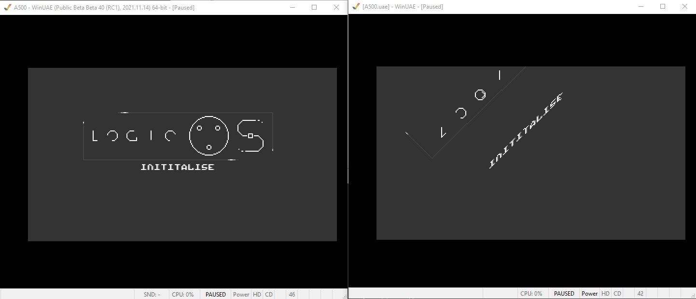
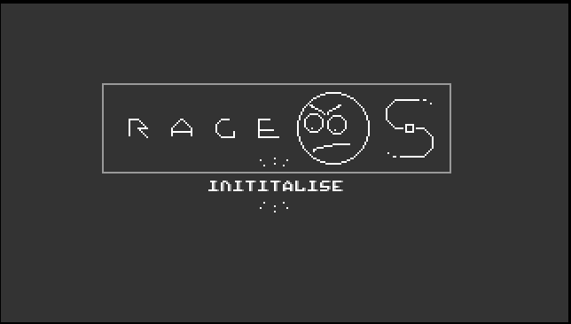

# rage-os

Let's reverse-engineer [Logic OS](https://www.pouet.net/prod.php?which=91307) and fuck it up
for [UC12](https://uc12.party/)'s DEMOHASS competition.

(Initial idea was to do a [Teletext cover](https://zxnet.co.uk/teletext/editor/#0:QIECBAgQIECBAgQIECBAgQIECBAgQIECBAgQIECBAgQIECAugQIECBAgQIECBAgQIECBAgQIECBAgQIECBAgQIECBAgQIC6BAgQIECBAgQIECBAgQIECBAgQIECBAgQIECBAgQIECBAgLoECBAgQIECBAgQIECBAgQIECBAgQIECBAgQIECBAgQIECAugQIECBAgQIECBAgQIECBAgQIECBAgQIECBAgQIECBAgQIC6BAgQIECBAgQIECBAgQIECBAgQIECBAgQIECBAgQIECBAgLvFixYsWLFixYsWLFixYsWLFixYsWLFixYsWLFixYsWLFmwu1QIECBAgQIECBAgQIECBAgQIECBAgQIECBAgQIECBAgQai7VAgQIECBAgQIECBAgQIECDgsRo0anIwQIEDhGjRqEjBBqLtUCBAgQIECBAgQIECBAgQOkDjJgWLGCpggbIECBAgQIEGou1QIECBAgQIECBAgQIECDQhVMEjVAo1INKDKgQIECBAgQai7VBqQIMCZSwQZkCBQzQoNSBAiRolKxCg1IEClJ3arGCBBqLtUGrggRYHCFBwcoEGJIg1INOThw4cFiDUgQIECBAgRNEGou1QIECBAgQIECBAgQIECBBlRJMrrglQYEqBAgQIECBA1Qai7VAgQIECBAgQIECBAgQIECJZwQIEGBwmQIEnBAgQYEyBBqLtUCBAgQIECBAgQIECBAgQIECBGjRoUCBAgQIESNGhQIEGov14cOHDhw4cOHDhw4cOHDhw4cOHDhw4cOHDhw4cOHDhw4ei6BAgQIECBAgQIECBAgQIECBAgQIECBAgQIECBAgQIECBAgLoECBAgQIECBAgQIECCTOk1JMGZJpxUCBAgQIECBAgQIECBAgQIECBAgQIECBAgQIECBAgQIECBAgQIECBAgQIECBAgQIECBAgQIECBAgQIECBAgQIECBAgQIECBAgQIECBAgQIECBAgL4cOHDhw4cObNmzZs2bN________cuXLly5cucOHDhw4cOEugQIECBAgQIECBAgQIECBAgQIECBAgQIECBAgQIECBAgQIECBAgQIECBAgQIECBAgQIECBAgQIECBAgQIECBAgQIECBAgQIECBAgQIECBAgQIECBAgQIECBAgQIECBAgQIECBAgQIECA:PS=0:RE=0:zx=PY0).)

## Rose

Directory `Rose` contains a copy of [Blueberry's Rose engine](https://github.com/askeksa/Rose).

Adjustments in `visualizer/Makefile` to have it compile under WSL2:

Before:

```
EXTERNAL := ../../Andres
CC := i686-w64-mingw32-g++
CFLAGS := -Iparser/rose -I$(EXTERNAL)/glfw-3.0.4.bin.WIN32/include -I$(EXTERNAL)/glew-1.10.0/include -I$(EXTERNAL)/portaudio/include -Wno-write-strings -std=c++11
LFLAGS := $(EXTERNAL)/glew-1.10.0/lib/Release/Win32/glew32s.lib -L$(EXTERNAL)/glfw-3.0.4.bin.WIN32/lib-mingw $(EXTERNAL)/portaudio/mingw32/usr/local/lib/libportaudio-2.dll -lglfw3 -lopengl32 -luser32 -lgdi32 -static-libgcc -static-libstdc++
```

After:

```
CC := g++
CFLAGS := -Iparser/rose -Wno-write-strings -std=c++11
LFLAGS := -lglfw -lGLEW -lOpenGL -lportaudio -static-libgcc -static-libstdc++ -s
```

After some `apt-get install`s, installing `VcXsrv` as X server if needed, and disabling audio (not needed anyway), it builds and runs!

```
apt install make
apt install libglew-dev
apt install g++
apt-get install libglfw3 libglfw3-dev
apt install openjdk-11-jre-headless
apt-get install portaudio19-dev
```

Initially, I also needed to invoke `java -jar tools/sablecc.jar -t cxx -d parser rose.sablecc` manually
for some reason for `make` (in directory `visualizer`) to succeed. YMMV.

```
horse-os/Rose/visualizer$ DISPLAY=:0 build/rose ../examples/Everyway.rose
```

## Rose concepts

It's turtles all the way. Turtle graphics!

Visuals can just be one big script file, like [Everywhere.rose](https://github.com/askeksa/Rose/blob/master/examples/Everyway.rose).
Music playback is the intro's responsibility.

Within the `.rose` file:

1. Section `plan`: Palette changes and waits ("color plan")
2. Section `proc main`: Main code
3. Actual work: Turtle movement, sub-procedures, forks (start sub-precedures with parameters), loops, calculate expressions 

When running the visualizer (executable `rose`), the current Rose file is monitored and playback restarts on changes.
Also, three binary blobs are generated each time which can later be included into the Amiga executable.

See: [original README.txt](Rose/README.txt)

## Extract Rose script from RAM

We want to rip the original demo's compiled Rose script and mess it up.

1. Run Logic OS in emulator
2. Save a RAM dump
3. Extract color script, constants, byte code
4. Turn bytecode into Rose script again
5. Cleverly reconstruct labels
6. Start modding

Ripping approaches: See page [Ripping Log](RippingLog.md)

## Run the original script

Ripping successful, demo starts. But something seems off... (left = original)



Never fully figured that one out. After I reverted one of the more recent commits
in `Engine.S`, it ran okay-ish, with the occasional crash.

## Decompiling the byte code

Color script and constants are easy, byte code consists of nasty bytes:
[Decompile Log](DecompileLog.md)

## Identifying procs

Where are the letters, logos, icons? [Proc analysis](ProcAnalysis.md) (boring notes, but a first step)

## Putting it all together

Enhanced the tooling, refactored the decompile logic (or rather, disassembly),
implemented the recompile step:

* Ability to use a single bytecode-like text script
* Handle constant pool and proc references automatically
* Mini-tools to decode/encode char data and icons

Time to put in some immature content for the lulz: [Creation Log](CreateLog.md)

The last day before the deadline was spent with messing up the music and
syncing. Sadly, I did not have time to re-sync the color script.



* [Final ADF](demo/AttentionWhore_RageOS.adf)
* [Final demo script: horse.txt](demo/horse.txt)
* [pouet.net entry](https://www.pouet.net/prod.php?which=91796)
* [YouTube capture](https://www.youtube.com/watch?v=BkYAixcse9M)

