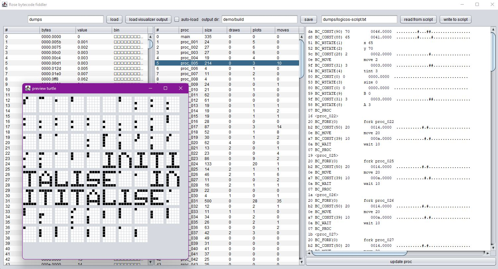

 # Ripping Rose script from RAM
 
Braindump/protocol.

## Approach: Find start of script

Using `PaintersFrustration.rose`, locate the main script in RAM.

Script start:

```
plan
	0:321 1:DDC 2:D00 3:080
	wait 1120
	0:400 1:BCD 2:00C 3:FC0
	wait 10
    ...
```

Idea: Find a memory area where the color values occur together and work from there.

Problem: Colors are not really encoded like that, and there is no main script, but three important
data blobs: Color script, bytecode, constants. Too fiddly.

## Approach: Intercept Rose initialization

From [Rose.S](Rose/engine/Rose.S), comments omitted:

```
RoseInit:
	; A1 = Color Script
	; A2 = Constants
	; A3 = Bytecode
	; A4 = Sinus
	; A5 = Rose Chip Space
	; A6 = Rose Space

	if	CLEARMEM
	move.l	a5,a0
	move.l	#ROSE_CHIPSIZE/4,d0
.cloop1:	clr.l	(a0)+
	subq.l	#1,d0
	bgt.b	.cloop1
	move.l	a6,a0
	move.l	#ROSE_FASTSIZE/4,d0
.cloop2:	clr.l	(a0)+
	subq.l	#1,d0
	bgt.b	.cloop2
	endif
	lea	PutCircle(pc),a0
	movem.l	a0-a4,(a6)
	lea.l	r_Circles(a6),a1
	move.l	a5,d0
	move.l	d0,d1
	add.l	#$10000-1,d1
	and.l	#-$10000,d1
	move.l	d1,(a1)+
	move.l	d1,d2
	add.l	#$10000,d2
```

Idea:
1. Start demo in emulator
2. Take RAM dump
3. Locate the startup code (where A1, A2, A3 get neatly initialized for us)
4. Restart emulator, set breakpoint
5. Note A1, A2, A3 values
6. Extract color script, constants, bytecode blocks from RAM dump

Also, step 0: Hope that the startup code in Logic OS has the same structure as the vanilla Rose implementation.

### Aimlessly wander through memory

RoseInit? Naa, more like startup code:

    00c0a968 4df9 00df f000           lea.l $00dff000,a6
    00c0a96e 3b6e 0010 0018           move.w (a6,$0010) == $00c132b0 [0005],(a5,$0018) == $00000018 [00fc]
    00c0a974 3b6e 001c 001a           move.w (a6,$001c) == $00c132bc [0004],(a5,$001a) == $0000001a [0820]
    00c0a97a 3b6e 0002 001c           move.w (a6,$0002) == $00c132a2 [ac0c],(a5,$001c) == $0000001c [00fc]
    00c0a980 303c 7fff                move.w #$7fff,d0
    00c0a984 6100 00c4                bsr.w #$00c4 == $00c0aa4a
    00c0a988 3d40 009a                move.w d0,(a6,$009a) == $00c1333a [09e6]
    00c0a98c 3d40 0096                move.w d0,(a6,$0096) == $00c13336 [08d8]
    00c0a990 3d40 009c                move.w d0,(a6,$009c) == $00c1333c [0bc0]
    00c0a994 2b68 006c 0014           move.l (a0,$006c) == $0000166c [00000385],(a5,$0014) == $00000014 [00fc081e]
    00c0a99a 43fa 00c8                lea.l (pc,$00c8) == $00c0aa64,a1
    00c0a99e 2149 006c                move.l a1,(a0,$006c) == $0000166c [00000385]
    00c0a9a2 3d7c c020 009a           move.w #$c020,(a6,$009a) == $00c1333a [09e6]
    00c0a9a8 7000                     moveq #$00,d0
    00c0a9aa 4e75                     rts  == $00c0b1dc
    00c0a9ac 4bfa 00fe                lea.l (pc,$00fe) == $00c0aaac,a5
    00c0a9b0 4df9 00df f000           lea.l $00dff000,a6
    00c0a9b6 42b9 00c0 aaa8           clr.l $00c0aaa8 [00c0ab6a]

    RoseMain:
    ; A6 = Rose Space
    lea.l	$dff000,a3
    move.l	r_Screen(a6),$048(a3)
    move.l	r_Circles(a6),$050(a3)
    move.l	r_Screen(a6),$054(a3)
    move.l	r_Coppers(a6),a0
    move.l	a0,$080(a3)
    addq.l	#4,a0
    move.l	a0,$084(a3)
    move.w	a0,$088(a3)

Found MakeCircles:

    00c0ab90 226e 0014                movea.l (a6,$0014) == $00c132b4 [00030000],a1
    00c0ab94 45ee 003c                lea.l (a6,$003c) == $00c132dc,a2
    00c0ab98 7e00                     moveq #$00,d7
    00c0ab9a 3007                     move.w d7,d0
    00c0ab9c d040                     add.w d0,d0
    00c0ab9e 3a07                     move.w d7,d5
    00c0aba0 e645                     asr.w #$03,d5
    00c0aba2 5245                     addq.w #$01,d5
    00c0aba4 cbc0                     muls.w d0,d5
    00c0aba6 3489                     move.w a1,(a2) [00c1]
    00c0aba8 db5a                     add.w d5,(a2)+ [00c1]
    00c0abaa 34c9                     move.w a1,(a2)+ [00c1]

    MakeCircles:
        move.l	r_Circles(a6),a1
        lea	r_CircleTable(a6),a2
        moveq.l	#0,d7
    .radiusloop:	move.w	d7,d0
        add.w	d0,d0
    
    	move.w	d7,d5
    	asr.w	#3,d5
    	addq.w	#1,d5	; Width in words
    	muls.w	d0,d5
    	move.w	a1,(a2)
    	add.w	d5,(a2)+	; Pointer to center line
    	move.w	a1,(a2)+	; Pointer to first line

If this is still like Test.S, inclusion order will be:

 * include	Rose:Rose.S
   * include	Rose:Engine.S
   * include	Rose:Circles.S
   * RegisterData (Rose.S)
   * Rose_Init (Rose.S)
   * RoseMain etc.
 * include	Rose:Sinus.S

RunFrame:

    00c0ad76 206e 0010                movea.l (a6,$0010) == $00c132b0 [0005cd40],a0
    00c0ad7a 286e 0008                movea.l (a6,$0008) == $00c132a8 [00c11e0e],a4
    00c0ad7e 2007                     move.l d7,d0

    RunFrame:
    ; A6 = Rose Space
    ; D7 = Frame
    move.l	r_Sinus(a6),a0
    move.l	r_Constants(a6),a4
    .frame:
    move.l	d7,d0

Found RoseInit!

    00c0b0e0 41fa fb2a                lea.l (pc,$fb2a) == $00c0ac0c,a0
    00c0b0e4 48d6 1f00                movem.l a0-a4,(a6)
    00c0b0e8 43ee 0014                lea.l (a6,$0014) == $00c132b4,a1
    00c0b0ec 200d                     move.l a5,d0
    00c0b0ee 2200                     move.l d0,d1
    00c0b0f0 d2bc 0000 ffff           add.l #$0000ffff,d1
    00c0b0f6 c2bc ffff 0000           and.l #$ffff0000,d1
    00c0b0fc 22c1                     move.l d1,(a1)+ [00390001]
    00c0b0fe 2401                     move.l d1,d2
    00c0b100 d4bc 0001 0000           add.l #$00010000,d2
    00c0b106 22c2                     move.l d2,(a1)+ [00390001]
    00c0b108 d4bc 0000 b400           add.l #$0000b400,d2
    00c0b10e 2042                     movea.l d2,a0
    00c0b110 b07c 5bf0                cmp.w #$5bf0,d0

    RoseInit:
    ; A1 = Color Script
    ; A2 = Constants
    ; A3 = Bytecode
    ; A4 = Sinus
    ; A5 = Rose Chip Space
    ; A6 = Rose Space
    	lea	PutCircle(pc),a0
    	movem.l	a0-a4,(a6)
    	lea.l	r_Circles(a6),a1
    	move.l	a5,d0
    	move.l	d0,d1
    	add.l	#$10000-1,d1
    	and.l	#-$10000,d1
    	move.l	d1,(a1)+
    	move.l	d1,d2
    	add.l	#$10000,d2
    	move.l	d2,(a1)+

### Extract Rose data blobs

Breakpoint:

    >f c0b0e0
    Breakpoint added.
    >g
    Breakpoint 0 triggered.
    Cycles: 1810789 Chip, 3621578 CPU. (V=105 H=1 -> V=308 H=3)
    D0 0000C000   D1 0000FFE0   D2 00C01BBC   D3 000063BC
    D4 00000000   D5 00000000   D6 000005FF   D7 00001000
    A0 0005ED40   A1 00C0CDA8   A2 00C11E0E   A3 00C0DD82
    A4 0005CD40   A5 0002D120   A6 00C132A0   A7 00C672CC

Where do the data blocks start and end?

    A1 00C0CDA8          - Color Script start
    A3 00C0DD82 ( +4058) - Color Script end,  Bytecode start
    A2 00C11E0E (+16524) - Bytecode end,      Constants start
       ?                 - Constants end

Inspect the stack: Where/how was RoseInit called?

    A7 00C672CC contains: 00C0AB00 00C0A8EC ...
    
    00c0aad6 43f9 00c0 cda8           lea.l $00c0cda8,a1  ; A1 = Color Script
    00c0aadc 45f9 00c1 1e0e           lea.l $00c11e0e,a2  ; A2 = Constants
    00c0aae2 47f9 00c0 dd82           lea.l $00c0dd82,a3  ; A3 = Bytecode
    00c0aae8 49f9 0005 cd40           lea.l $0005cd40,a4  ; A4 = Sinus
    00c0aaee 4bf9 0002 d120           lea.l $0002d120,a5  ; A5 = Rose Chip Space
    00c0aaf4 4df9 00c1 32a0           lea.l $00c132a0,a6  ; A6 = Rose Space
    00c0aafa 4eb9 00c0 b0e0           jsr $00c0b0e0       ; RoseInit

0c132a0 = Memory space, so bytecode area will end there. In summary:

| Start (incl) | End (excl) |  Size | What | Start |
|--------------|------------|------:|------|-------|
| `C0CDA8`     | `C0DD82`   |  4058 | Color Script | FFFF 0333 1444 2999 3FFF 4000 5666 6AAA |
| `C0DD82`     | `C11E0E`   | 16524 | Bytecode | 8056 A1D7 0F0A 0705 20A1 D70F 0AA1 D70F |
| `C11E0E`     | `C132A0`   |  5266 | Constants | 0000 0000 0000 005B 0000 0075 0000 00C0 |

In WinUAE debugger:

    S <file> <addr> <n>   Save a block of Amiga memory.
    
    >S colorscript.bin $C0CDA8 !4058
    Wrote 00C0CDA8 - 00C0DD82 (4058 bytes) to 'colorscript.bin'.
    >S bytecodes.bin $C0DD82 !16524
    Wrote 00C0DD82 - 00C11E0E (16524 bytes) to 'bytecodes.bin'.
    >S constants.bin C11E0E !5266
    Wrote 00C11E0E - 00C132A0 (5266 bytes) to 'constants.bin'.

Note: According to Test.S, constants block might be way shorter? Well, nevermind.

    Constants:
        ds.l	382

Decompile whoopsie: Why is 180 everywhere? Well, it isn't...

    fe	BC_CONST(126) 180	<-- FE... hmm, is this really the constant $fe? YEEES FUCK... 
   	77	BC_RSTATE(time) 	

In the code:

    #define BIG_CONSTANT_BASE 126
    0x7e hex --> as constant (+0x80) == 0xfe
    
    fe 77 means: constant 0x77+BIG_CONSTANT_BASE = 119+126 = constant #245

So, *there*'s the graphics data. Or is it? From proc_005:

    fe 78 BC_CONST(246) 63584.127           	#####....##.......#.....#....###
    fe 28 BC_CONST(166) 4222.234            	...#.....######...####......#...
    fe 78 BC_CONST(246) 63584.127           	#####....##.......#.....#....###
    fe 77 BC_CONST(245) 61505.004           	####.....#.....#.......#.....###
    fe 78 BC_CONST(246) 63584.127           	#####....##.......#.....#....###
    fe 77 BC_CONST(245) 61505.004           	####.....#.....#.......#.....###
    fe 2f BC_CONST(173) 5308.235            	...#.#..#.####....####...#..#..#
    fe 23 BC_CONST(161) 2111.189            	....#.....######..##....#.....#.
    fe 78 BC_CONST(246) 63584.127           	#####....##.......#.....#....### 
    fe 69 BC_CONST(231) 39534.1             	#..##.#..##.###....##..##.#..##. 
    fe 6c BC_CONST(234) 39551.131           	#..##.#..#######..#....##....##.
    07 BC_PROC          
    d0 <proc_208>       
    2b BC_FORK(11)      	fork proc_208 63584.127 4222.234 63584.127 61505.004 63584.127 61505.004 5308.235 2111.189 63584.127 39534.1 39551.131

Hmm, 11 pattern longwords, but 10 letters in "INITIALISE"? Let's repeat first and last 

BWAHAHA... It *IS* one const per letter, but the intro title says "initi-T-alise" :) https://www.pouet.net/prod.php?which=91307 Good one, hoff!

What's the pixel format, then:

* char size = 5*6 = 30
* 32 bits per char provided; 2 unused?
* one of the plotting subroutines uses "ror 6"; hm...

Hmmm... I looks like:

    .###.  <--  3+4+5 = 12 set pixels (18 unset)
    ..#..  
    ..#..  
    ..#..  
    ..#..        longword from code:
    #####        #####....##.......#.....#....### <-- also 12 pixels  

ROR it by 6 five times:

    integer part     fractional part
    [--------------][--------------]       test with data & 1 uses the integer part only!
    #####....##.......#.....#....###       #.....
    ...########....##.......#.....#.       #....#
    ....#....########....##.......#.       ######  <-- there!
    ....#.....#....########....##...       #....#
    .##.......#.....#....########...       #.....

L:

    ....#.....######..##....#.....#.       ######
    ....#.....#.....######..##....#.       #.....
    ....#.....#.....#.....######..##       #.....
    ##..##....#.....#.....#.....####       #.....
    ..######..##....#.....#.....#...       ##....

Nice!




