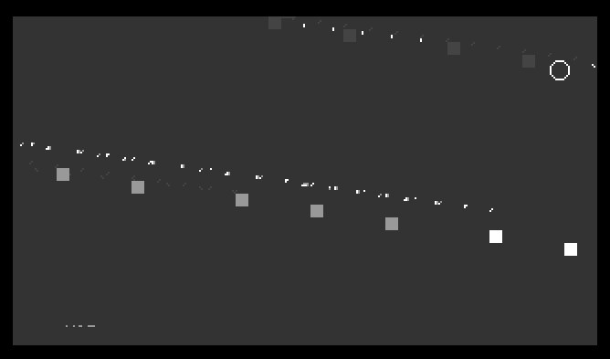
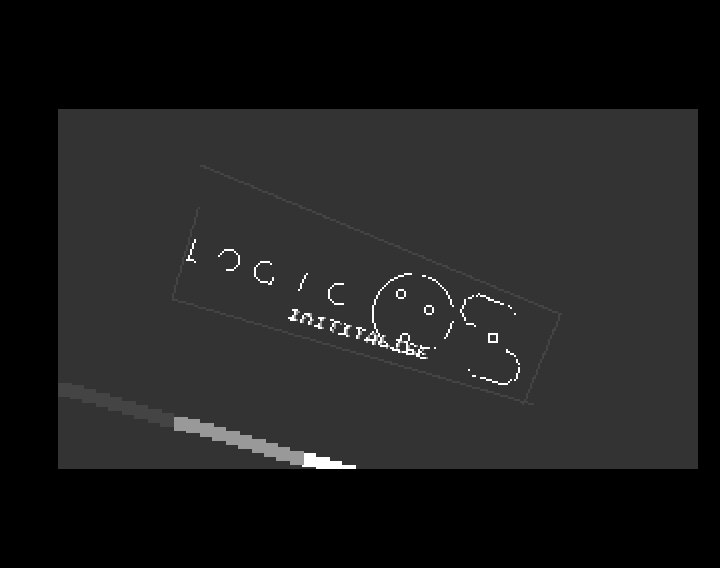
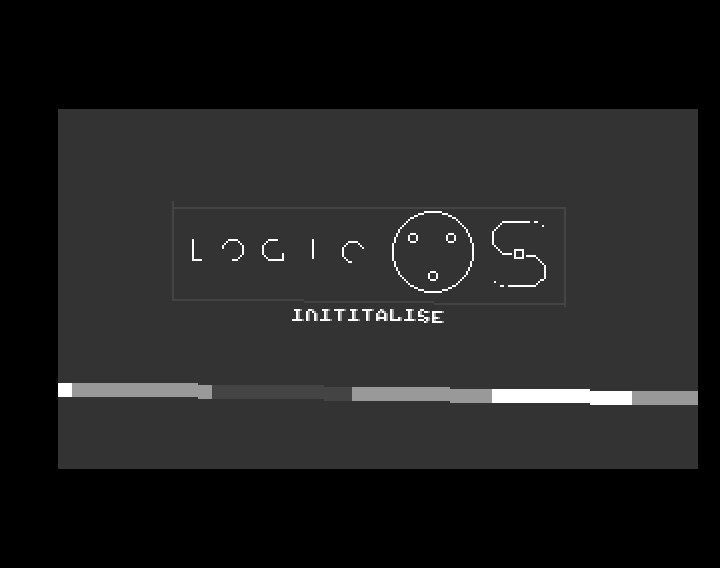

# Log: Getting original demo to run

## Constant hunting

Image is sheared, maybe some config constants are off? Let's look at Circles.S:

    00c0abea 5247                     addq.w #$01,d7              addq.w	#1,d7
    00c0abec be7c 0046                cmp.w #$0046,d7             cmp.w	#MAXRADIUS,d7
    00c0abf0 6fa8                     ble.b #$a8 == $00c0ab9a (T) ble.b	.radiusloop
	
    00c0abf4 45ee 0158                lea.l (a6,$0158) == $00c133f8,a2  lea	r_CircleBufPtr(a6),a2
    00c0abf8 3a3c 013f                move.w #$013f,d5                  move.w	#MAXRADIUS*2+SCREENHEIGHT-1,d5

    00c0ac14 d442                     add.w d2,d2                 add.w	d2,d2
    00c0ac16 9042                     sub.w d2,d0                 sub.w	d2,d0
    00c0ac18 b07c 0140                cmp.w #$0140,d0             cmp.w	#DISPLAYWIDTH,d0

    00c0ac44 4846                     swap.w d6            	      swap.w	d6
    00c0ac46 3a3c 00b4                move.w #$00b4,d5     .circle:move.w	#SCREENHEIGHT,d5 ; Clip and cull to bottom
    00c0ac4a 9a41                     sub.w d1,d5                 sub.w	d1,d5
    00c0ac4c 9a44                     sub.w d4,d5                 sub.w	d4,d5

| Const | Value |
|-------|-------|
| SCREENHEIGHT | 180 |
| MAXRADIUS | 70 |
| DISPLAYWIDTH | 320 |

Hmpf, these are already the default values in RoseConfig.S.

RoseInit:

    00c0b100 d4bc 0001 0000           add.l #$00010000,d2           add.l	#$10000,d2
    00c0b106 22c2                     move.l d2,(a1)+ [00e60001]    move.l	d2,(a1)+
    00c0b108 d4bc 0000 b400           add.l #$0000b400,d2           add.l	#SCREENSIZE,d2
    00c0b10e 2042                     movea.l d2,a0                 move.l	d2,a0
    00c0b110 b07c 5bf0                cmp.w #$5bf0,d0               cmp.w	#(-COPPERBUFFER)&$FFFF,d0
    00c0b114 6202                     bhi.b #$02 == $00c0b118 (F)   bhi.b	.copperslast

    SCREENSIZE = 46080 = SCREENWIDTH*SCREENHEIGHT/8*SCREENDEPTH
                 46080 = SCREENWIDTH*    180/8     *SCREENDEPTH
                 46080 = SCREENWIDTH*     22       *SCREENDEPTH
                  2094 = SCREENWIDTH * SCREENDEPTH
                  2094 =         698 * 3

| Const | Value |
|-------|-------|
| SCREENWIDTH | 698 |
| SCREENDEPTH | 3 |

698 = 512 + 186? hmm

Aha! Slightly "better":

Maybe find on of these fuckers:

    GUARDBAND	=	144
    LEFTPOS	=	129
    TOPPOS	=	82

    00c0acac 6a06                     bpl.b #$06 == $00c0acb4 (T)  	bpl.b	.circle
    00c0acae 9242                     sub.w d2,d1                  	sub.w	d2,d1
    00c0acb0 9242                     sub.w d2,d1                  	sub.w	d2,d1
    00c0acb2 4643                     not.w d3                     	not.w	d3
    00c0acb4 d07c 0090                add.w #$0090,d0               add.w	#GUARDBAND,d0	; X on banded screen

| Const | Value |
|-------|-------|
| GUARDBAND | 144 |

Already the default :(

Wait, this does not add up:

    SCREENSIZE = SCREENWIDTH*SCREENHEIGHT/8*SCREENDEPTH
    SCREENSIZE = SCREENWIDTH*180/8*3
         46080 = SCREENWIDTH*67.5
      682.6666 = SCREENWIDTH
    
    SCREENWIDTH*SCREENHEIGHT/8*SCREENDEPTH 
                     698*180/8*SCREENDEPTH
                      125640/8*3
                         15705*3
                        = 47115 <-- not 46080

00c0ac96 222e 0020                move.l (a6,$0020) == $00c132c0 [0004b4ac],d1    move.l	r_CopperLimit(a6),d1
00c0ac9a 928b                     sub.l a3,d1                                     sub.l	a3,d1
00c0ac9c b2bc 0000 0064           cmp.l #$00000064,d1                             cmp.l	#MARGIN,d1
00c0aca2 63f2                     bls.b #$f2 == $00c0ac96 (T)                     bls.b	.stall\@

| Const | Value |
|-------|-------|
| MARGIN | 100 |

Default, again :(

    00c0acbc d842                     add.w d2,d4               	add.w	d2,d4	; Blit Size
    00c0acbe 7a40                     moveq #$40,d5             	moveq.l	#SCREENWIDTH/8,d5
    00c0acc0 d442                     add.w d2,d2               	add.w	d2,d2	; Width in bytes
    00c0acc2 9a42                     sub.w d2,d5               	sub.w	d2,d5	; C/D modulo
    00c0acc4 7c0f                     moveq #$0f,d6             	moveq.l	#15,d6

SCREENWIDTH is 512, like the default! SCREENDEPTH is also the default...

    SCREENWIDTH*SCREENHEIGHT/8*SCREENDEPTH 
                     512*180/8*SCREENDEPTH
                       92160/8*4
                         11520*4
                        = 46080

| Const | Value |
|-------|-------|
| SCREENWIDTH | 512 |
| SCREENDEPTH | 4 |

## Sine off?

Logic OS sine table in memory = 05cd40 .. 064D40 (size $8000 = 32768 bytes), as words: 16384 degrees

That's also the default: DEGREES	=	16384

## Data corrupt?

What could cause that shear effect?

* x=0 y=100 is ok
* x=1 y=100 becomes x=1 y=99
* x=2 y=100 becomes x=2 y=98 etc.

Y stride is off by one?

Let's try adding a constant to the sine values:

    SINE_OFF=$1000 ; LOSSO
    
    Snip_sine:
    ;move.l	(a3)+,d0
    add.w	#SINE_OFF,d0
    lsr.w	#2,d0
    add.w	d0,d0
    move.w	(a0,d0.w),d0
    
    Snip_move:
    ;move.l	(a3)+,d0
    move.l	d0,d2
    move.l	st_dir(a5),d0
    asr.l	#8,d0
    add.w	#SINE_OFF,d0

Better? Hmmm...

## Snip offsets

Wait a minute: Adding a `nop` to Snip_sine changes the angle! 

How, what...?

* Engine.S is a machine code generator, generated from bytecode snips!
* Maybe Logic OS has custom snips that mess up weirdly when played back with an incompatible engine

Just for fun: Undid the last Engine.S [commit](https://github.com/askeksa/Rose/commit/8c16d11b102b307ede535a38749893388075ecee) and, viola:

Ever-so-slighty off, but perferct for our means!

We only wanted to verify we extracted the data correctly, anyway. But titling everything by 1 degree would be a nice touch.

